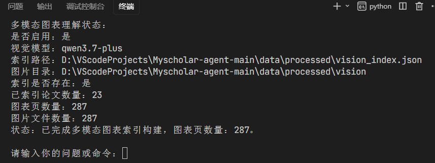
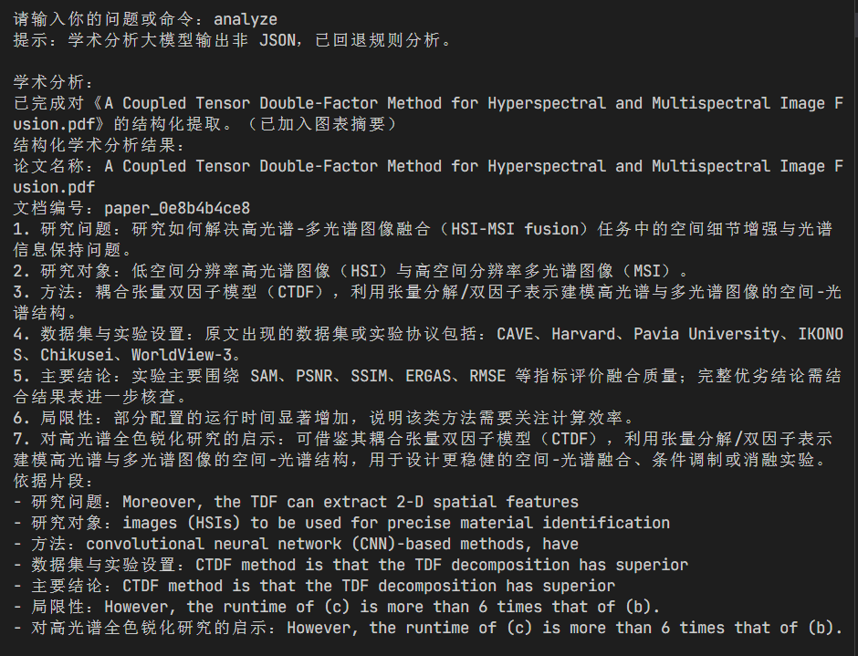
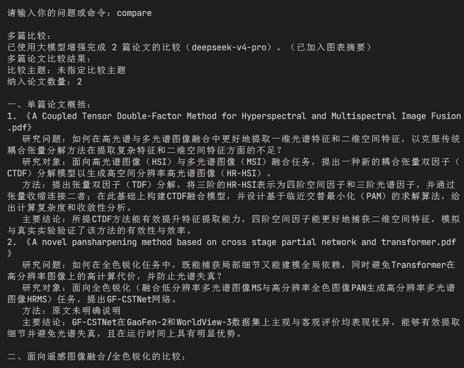
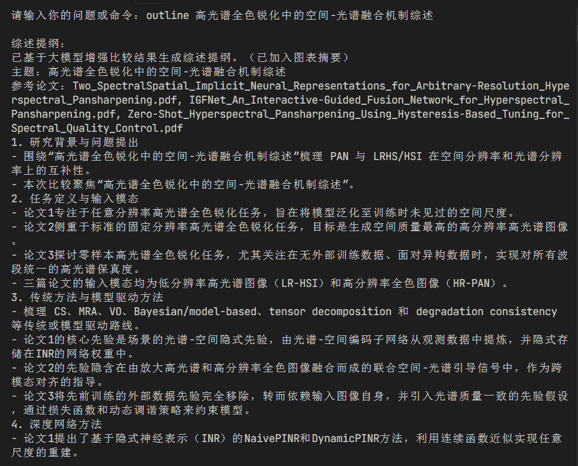
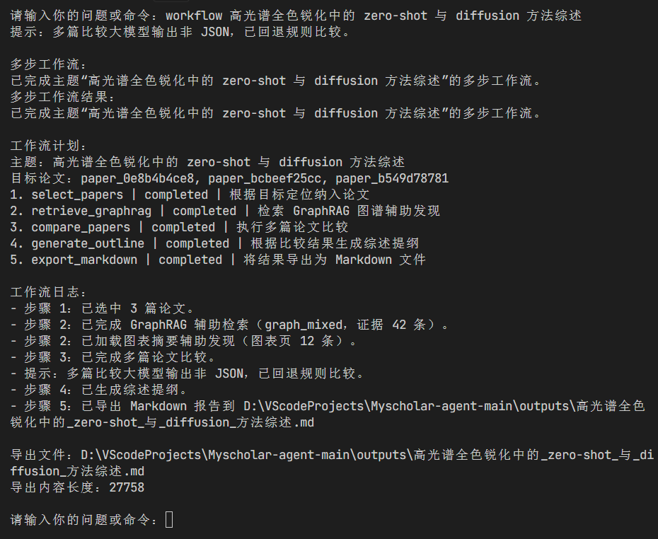

# HSPansharpeningScholar-Agent

## 项目简介

HSPansharpeningScholar-Agent 是一个基于本地论文库的科研助教 Agent。本项目在课程项目 CityScholar-Agent 的基础目标上，面向全色锐化、高光谱全色锐化、遥感图像融合和空间-光谱建模等研究方向进行了领域化改造。

系统能够读取 `data/raw_papers/` 下的本地 PDF 论文，构建可检索的论文知识库，并围绕用户输入的问题或命令完成检索问答、单篇论文分析、多篇论文比较、综述提纲生成和 Markdown 报告导出。同时，项目增加了本地向量索引、GraphRAG 图增强检索和多模态图表理解能力，用于支持更完整的论文阅读与综述准备流程。

## 作业要求完成情况


| 作业要求          | 项目实现                                                                                 |
| ------------- | ------------------------------------------------------------------------------------ |
| 读取本地 PDF 论文   | `rag/loader.py` 负责发现 PDF 文件，`rag/parser.py` 负责解析论文文本与页码信息。                           |
| 构建本地论文知识库     | `core/agent.py` 调用解析、切块与检索模块，将论文转换为可问答的 chunk records。                               |
| 最小问答功能        | 直接输入问题或使用 `ask :: 问题`，系统会基于本地论文片段生成带来源的回答。                                           |
| 单篇论文分析        | `analyze`、`analyze 1` 或 `analyze 关键词` 可输出研究问题、研究对象、方法、数据集、指标、结论与局限。                  |
| 多篇论文比较        | `compare`、`compare 1,2` 或 `compare 1,2 :: 主题` 可对多篇论文进行结构化比较。                         |
| 综述提纲生成        | `outline 综述主题` 或 `outline 1,2,3 :: 综述主题` 可生成面向综述写作的章节提纲。                             |
| 多步科研工作流       | `workflow 主题` 会串联论文选择、GraphRAG 辅助发现、多篇比较、提纲生成和 Markdown 导出。                          |
| Markdown 报告导出 | `tools/export_tool.py` 和 `core/workflow.py` 将工作流结果保存到 `outputs/`。                    |
| 本地 RAG 与混合检索  | 支持关键词检索；配置 API 后可构建 embedding 向量索引，并在问答时执行关键词与向量结合的混合检索。                             |
| 向量索引本地保存和加载   | `rag/embedder.py` 将 embedding 索引保存到 `data/processed/embedding_index_*.json`，下次启动可复用。 |
| 向量不可用时回退      | 当未配置 API、向量索引不存在或向量检索失败时，系统自动回退到关键词检索。                                               |
| 可选扩展能力        | 已实现 GraphRAG 图增强检索和多模态论文图表理解。                                                        |


## 领域定位

项目聚焦遥感图像融合领域，当前论文库主要覆盖以下主题：

- pansharpening 与 multispectral pansharpening
- hyperspectral pansharpening 与 HSI-MSI fusion
- spatial-spectral fusion、attention、transformer、neural operator
- latent diffusion、zero-shot、pretraining foundation model
- 数据集、退化模型、评价指标和实验对比

因此，本项目不仅能完成通用论文助教 Agent 的基础任务，还能围绕高光谱全色锐化方向辅助梳理 related work、baseline、模型设计启发、评价指标和后续综述结构。

## 项目结构

```text
HSPansharpeningScholar-Agent/
├─ README.md                       # 项目说明文档
├─ requirements.txt                # Python 依赖列表
├─ config.py                       # 目录、模型、API、GraphRAG 和多模态参数配置
├─ app.py                          # 命令行入口，负责启动、命令解析和结果展示
├─ llm_dashscope.py                # DashScope/OpenAI 兼容接口封装
├─ AGENT.md                        # 项目开发规范与教学化代码要求
├─ core/
│  ├─ agent.py                     # Agent 主控逻辑，统一管理建库、检索、问答、分析、比较和工作流
│  ├─ prompts.py                   # 问答系统提示词和任务提示词
│  └─ workflow.py                  # 多步科研工作流的计划、状态和导出调度
├─ rag/
│  ├─ loader.py                    # 本地 PDF 文件发现
│  ├─ parser.py                    # PDF 文本解析、页码保留和文档 ID 生成
│  ├─ splitter.py                  # 文本切块与 chunk record 构建
│  ├─ retriever.py                 # 关键词检索、向量相似度和混合检索
│  └─ embedder.py                  # embedding 索引构建、保存、加载与兼容性检查
├─ graph/
│  ├─ extractor.py                 # 从论文片段抽取实体、关系和 claim
│  ├─ normalizer.py                # 实体标准化、别名合并和 ID 生成
│  ├─ builder.py                   # 图谱索引构建
│  ├─ store.py                     # 图谱数据结构、序列化与状态统计
│  ├─ retriever.py                 # GraphRAG local/global/mixed 检索
│  ├─ router.py                    # 根据问题类型选择检索路由
│  ├─ community.py                 # 图谱社群发现
│  └─ summarizer.py                # 图谱社群摘要生成
├─ multimodal/
│  ├─ extractor.py                 # 识别论文图表页并渲染为 PNG
│  ├─ summarizer.py                # 调用视觉语言模型生成图表摘要
│  ├─ retriever.py                 # 基于问题检索相关图表摘要
│  └─ store.py                     # 多模态图表索引保存、加载和状态统计
├─ tools/
│  ├─ analyze_tool.py              # 单篇论文结构化分析
│  ├─ compare_tool.py              # 多篇论文比较
│  ├─ outline_tool.py              # 综述提纲生成
│  └─ export_tool.py               # 工作流结果导出为 Markdown
├─ data/
│  ├─ raw_papers/                  # 本地 PDF 论文库
│  └─ processed/                   # 本地索引文件，包含 embedding、graph 和 vision 索引
├─ outputs/                        # 工作流导出的 Markdown 报告
├─ result_photo/                   # 作业运行结果截图
├─ notebooks/                      # 课程阶段性 notebook 与说明材料
└─ scripts/                        # notebook 构建与编码检查辅助脚本
```

## 核心功能说明

### 1. 本地论文知识库

启动时，系统会扫描 `data/raw_papers/` 中的 PDF 文件，并通过以下流程构建本地知识库：

1. `rag/loader.py` 发现 PDF 文件。
2. `rag/parser.py` 解析每篇论文的文本、页码、文件名和文档编号。
3. `rag/splitter.py` 将论文文本切分为带来源信息的文本片段。
4. `core/agent.py` 保存当前知识库状态，供问答、分析、比较和工作流复用。

解析失败的 PDF 会被记录为错误信息，但不会影响其他论文进入知识库。

### 2. 检索问答

系统支持两类问答入口：

```text
ask :: 高光谱全色锐化方法通常如何同时保持空间细节和光谱一致性？
高光谱全色锐化中 SAM 和 ERGAS 分别反映什么？
```

当本地向量索引可用时，系统会优先执行混合检索：关键词召回负责稳定命中术语，embedding 相似度负责补充语义相关片段。当向量索引不可用、API 未配置或向量检索调用失败时，系统自动回退到关键词检索，保证最小问答流程可用。

### 3. 单篇论文分析

单篇分析由 `tools/analyze_tool.py` 实现，支持从论文中抽取以下字段：

- 研究问题
- 研究对象
- 核心方法
- 使用数据集
- 评价指标
- 主要结论
- 优势与局限

常用命令：

```text
analyze
analyze 1
analyze HyperTransformer
```

### 4. 多篇论文比较

多篇比较由 `tools/compare_tool.py` 实现，先对每篇论文执行结构化分析，再围绕任务类型、输入模态、空间建模、光谱建模、数据集、指标、优势与局限进行横向对比。

常用命令：

```text
compare
compare 1,2
compare 1,2,3 :: 空间-光谱融合机制
```

### 5. 综述提纲生成

综述提纲由 `tools/outline_tool.py` 实现。用户可以显式指定论文，也可以只给出综述主题，由系统根据主题关键词自动选择相关论文。

常用命令：

```text
outline 高光谱全色锐化中的空间-光谱融合机制综述
outline 1,2,3 :: 高光谱全色锐化中的注意力与门控机制综述
```

### 6. 多步科研工作流

工作流由 `core/workflow.py` 和 `core/agent.py` 串联执行，默认包含五个步骤：

1. 选择纳入论文。
2. 检索 GraphRAG 辅助发现。
3. 执行多篇论文比较。
4. 生成综述提纲。
5. 导出 Markdown 报告。

常用命令：

```text
workflow 高光谱全色锐化中的 zero-shot 与 diffusion 方法综述
workflow 1,2,3
workflow 1,2,3 :: 基于指定论文生成高光谱全色锐化综述
```

导出的 Markdown 文件会保存到 `outputs/` 目录。

### 7. GraphRAG 图增强检索

GraphRAG 是本项目的扩展能力之一。系统会从论文片段中抽取实体、关系和主题社群，用于回答涉及方法关联、数据集关系、指标关系、研究脉络和全局综述类的问题。

相关命令：

```text
build_graph
rebuild_graph
graph_status
```

GraphRAG 索引默认保存到：

```text
data/processed/graph_index.json
```

问答时，系统会根据问题自动在以下路由中选择：

- `hybrid_rag`：普通关键词/向量混合检索
- `graph_local`：围绕实体和邻接关系的局部图检索
- `graph_global`：围绕主题社群摘要的全局图检索
- `graph_mixed`：局部关系、全局社群和原文片段联合检索

### 8. 多模态图表理解

多模态能力是本项目的另一个扩展方向。系统会检测 PDF 中可能包含 Figure、Table、模型结构图、实验结果表格、消融实验和可视化结果的页面，将整页渲染为 PNG，并调用视觉语言模型生成结构化图表摘要。

相关命令：

```text
build_vision
rebuild_vision
vision_status
figures
vision :: 哪些论文的实验表格报告了 PSNR、SSIM、SAM 和 ERGAS？
看图 :: 这篇论文的模型结构图说明了什么？
```

多模态索引默认保存到：

```text
data/processed/vision_index.json
data/processed/vision/
```

图表摘要不会替代论文原文，只作为补充证据进入问答、分析、比较、提纲和工作流导出。

## 环境依赖

项目使用 Python 3.10 及以上版本。核心依赖在 `requirements.txt` 中声明：

```text
pypdf>=5.1.0,<6.0.0
pymupdf>=1.24.0,<2.0.0
Pillow>=10.0.0,<12.0.0
networkx>=3.4.2,<4.0.0
python-louvain>=0.16,<0.17
```

依赖用途如下：


| 依赖               | 用途                       |
| ---------------- | ------------------------ |
| `pypdf`          | 解析 PDF 文本，支撑基础论文知识库。     |
| `pymupdf`        | 将论文图表页渲染为 PNG，支撑多模态图表理解。 |
| `Pillow`         | 图像处理备用依赖。                |
| `networkx`       | 构建和处理论文知识图谱。             |
| `python-louvain` | 执行图谱社群发现。                |


## 运行方式

### 1. 创建环境并安装依赖

Windows PowerShell 示例：

```powershell
python -m venv .venv
.\.venv\Scripts\Activate.ps1
pip install -r requirements.txt
```

如果使用 Conda：

```powershell
conda create -n city-scholar python=3.11
conda activate city-scholar
pip install -r requirements.txt
```

### 2. 配置大模型 API

基础关键词检索和规则分析不强制依赖 API，但向量索引、LLM 增强分析、GraphRAG 摘要和多模态图表摘要需要配置大模型接口。

本项目默认使用 DashScope 的 OpenAI 兼容接口：

```powershell
$env:DASHSCOPE_API_KEY="你的 API Key"
```

或者在配置文件config.py中配置：
```powershell
DASHSCOPE_API_KEY = os.getenv("DASHSCOPE_API_KEY", "请在此处输入您的 DashScope API Key").strip()
```

可选环境变量：

```powershell
$env:DASHSCOPE_BASE_URL="https://dashscope.aliyuncs.com/compatible-mode/v1"
$env:DASHSCOPE_ANSWER_MODEL="qwen3.7-plus"
$env:DASHSCOPE_ANALYSIS_MODEL="deepseek-v4-pro"
$env:DASHSCOPE_EMBEDDING_MODEL="text-embedding-v4"
$env:DASHSCOPE_EMBEDDING_DIMENSIONS="128"
$env:DASHSCOPE_VISION_MODEL="qwen-vl-plus"
$env:GRAPH_ENABLED="true"
$env:VISION_ENABLED="true"
```

这些其他的变量亦可在config.py中配置。

### 3. 准备本地论文

将论文 PDF 放入：

```text
data/raw_papers/
```

**由于论文太多无法直接上传到Github,因此在运行代码之前一定要通过百度网盘链接:
https://pan.baidu.com/s/1eZmMOFuscDp2R9Bi1cQVYQ?pwd=1fhk 提取码: 1fhk 
下载data数据集并复制到项目中**


### 4. 启动程序

```powershell
python app.py
```

启动后，程序会自动创建以下目录：

```text
data/
data/raw_papers/
data/processed/
data/processed/vision/
outputs/
```

如果 `data/raw_papers/` 中没有 PDF，程序会提示补充论文后重新运行。

## 命令清单


| 命令                     | 功能                       |
| ---------------------- | ------------------------ |
| `help`                 | 查看命令帮助。                  |
| `papers`               | 查看当前可用论文列表。              |
| `ask :: 问题`            | 基于本地论文知识库问答。             |
| `直接输入问题`               | 等价于问答命令，系统自动选择检索路由。      |
| `build_index`          | 构建本地 embedding 向量索引。     |
| `rebuild_index`        | 强制重建本地 embedding 向量索引。   |
| `build_graph`          | 构建本地图谱索引。                |
| `rebuild_graph`        | 强制重建本地图谱索引。              |
| `graph_status`         | 查看图谱索引状态。                |
| `build_vision`         | 构建多模态图表索引。               |
| `rebuild_vision`       | 强制重建多模态图表索引。             |
| `vision_status`        | 查看多模态图表索引状态。             |
| `figures`              | 列出已识别的图表页。               |
| `vision :: 问题`         | 基于图表摘要进行问答。              |
| `看图 :: 问题`             | 与 `vision :: 问题` 等价。     |
| `analyze`              | 默认分析第一篇论文。               |
| `analyze 1`            | 分析第 1 篇论文。               |
| `analyze 关键词`          | 按文件名或文档编号模糊匹配论文并分析。      |
| `compare`              | 默认比较前两篇论文。               |
| `compare 1,2`          | 比较指定论文。                  |
| `compare 1,2 :: 主题`    | 按主题比较指定论文。               |
| `outline 主题`           | 根据主题生成综述提纲。              |
| `outline 1,2,3 :: 主题`  | 基于指定论文生成综述提纲。            |
| `workflow 主题`          | 执行完整科研辅助工作流并导出 Markdown。 |
| `workflow 1,2,3`       | 基于指定论文执行默认综述工作流。         |
| `workflow 1,2,3 :: 主题` | 基于指定论文和主题执行工作流。          |
| `exit`                 | 退出程序。                    |


## 推荐运行流程

第一次运行时建议按以下顺序操作：

```text
papers
build_index
build_graph
build_vision
ask :: 高光谱全色锐化中常见的空间-光谱融合策略有哪些？
analyze 1
compare 1,2 :: 空间-光谱建模机制
outline 1,2,3 :: 高光谱全色锐化中的空间-光谱融合机制综述
workflow 1,2,3 :: 基于指定论文生成高光谱全色锐化综述
```

如果只是验证最小功能，可以不构建向量、图谱和视觉索引，直接运行：

```text
papers
ask :: 这些论文主要研究什么问题？
analyze 1
compare 1,2
workflow 高光谱全色锐化方法综述
```

说明：当前项目已经生成普通向量索引、GraphRAG 图谱索引和多模态图表索引。评阅时可优先使用 `papers`、`graph_status`、`vision_status`、`analyze`、`compare`、`outline`、`workflow` 等命令查看结果；如果重新执行 `rebuild_index`、`rebuild_graph` 或 `rebuild_vision`，由于论文数量较多，耗时可能较长。


## 配置说明

主要配置集中在 `config.py`，并支持通过环境变量覆盖。


| 配置项                              | 默认值                                | 说明                           |
| -------------------------------- | ---------------------------------- | ---------------------------- |
| `DASHSCOPE_API_KEY`              | 空                                  | API Key，未配置时仅启用无需 API 的基础流程。 |
| `DASHSCOPE_BASE_URL`             | DashScope 兼容接口地址                   | OpenAI 兼容接口基础 URL。           |
| `DASHSCOPE_ANSWER_MODEL`         | `qwen3.7-plus`                     | 问答增强模型。                      |
| `DASHSCOPE_ANALYSIS_MODEL`       | `deepseek-v4-pro`                  | 结构化分析增强模型。                   |
| `DASHSCOPE_EMBEDDING_MODEL`      | `text-embedding-v4`                | 文本向量模型。                      |
| `DASHSCOPE_EMBEDDING_DIMENSIONS` | `128`                              | embedding 向量维度。              |
| `GRAPH_ENABLED`                  | `True`                             | 是否启用 GraphRAG 路由。            |
| `GRAPH_INDEX_PATH`               | `data/processed/graph_index.json`  | 图谱索引路径。                      |
| `GRAPH_MAX_HOPS`                 | `2`                                | GraphRAG 局部关系扩展跳数。           |
| `VISION_ENABLED`                 | `True`                             | 是否启用多模态图表理解。                 |
| `DASHSCOPE_VISION_MODEL`         | `qwen-vl-plus`                     | 视觉语言模型。                      |
| `VISION_INDEX_PATH`              | `data/processed/vision_index.json` | 图表摘要索引路径。                    |
| `VISION_IMAGE_DIR`               | `data/processed/vision`            | 图表页 PNG 输出目录。                |
| `VISION_RENDER_ZOOM`             | `2.0`                              | PDF 页面渲染倍率。                  |
| `VISION_MAX_PAGES_PER_PAPER`     | `30`                               | 每篇论文最多处理的候选图表页数。             |
| `VISION_TOP_K`                   | `3`                                | 图表问答默认召回数量。                  |


## 索引与输出文件

运行过程中会产生以下文件：

```text
data/processed/embedding_index_text-embedding-v4_dim128.json
data/processed/graph_index.json
data/processed/vision_index.json
data/processed/vision/<document_id>/page_001.png
outputs/<workflow_topic>.md
```

当前仓库中已经包含以下本地索引文件，便于直接复现实验结果：

```text
data/processed/embedding_index_text-embedding-v4_dim128.json
data/processed/graph_index.json
data/processed/vision_index.json
```

如果论文库发生变化，建议重新构建索引：

```text
rebuild_index
rebuild_graph
rebuild_vision
```

## 回退机制

为了保证课程作业要求中的“最小可用系统”稳定运行，项目设计了多级回退：

- 未配置 `DASHSCOPE_API_KEY` 时，仍可执行 PDF 解析、关键词检索、规则问答、规则分析、比较、提纲和工作流。
- embedding 索引不存在时，问答会使用关键词检索。
- embedding 请求失败时，系统会自动回退到关键词检索。
- GraphRAG 索引不存在或与当前论文库不匹配时，问答会回退到普通 Hybrid RAG。
- 多模态索引不存在或视觉模型调用失败时，系统仍保留文本 RAG、GraphRAG 和规则分析流程。

## 运行示例结果

本节展示当前项目已经完成的主要命令运行结果。截图统一保存在 `result_photo/` 目录中，覆盖索引构建、单篇论文分析、多篇论文比较、综述提纲生成和 Markdown 工作流导出等作业要求中的核心功能。

### 1. 多模态图表索引构建

命令示例：

```text
rebuild_vision
vision_status
```

运行结果说明：系统已启用多模态图表理解，截图运行环境中显示的视觉模型为 `qwen3.7-plus`；代码默认视觉模型为 `qwen-vl-plus`，可通过 `DASHSCOPE_VISION_MODEL` 覆盖。当前已为 23 篇论文构建图表索引，共识别并保存 287 个图表页条目。图表索引保存于 `data/processed/vision_index.json`，图表页图片保存于 `data/processed/vision/`。



### 2. 单篇论文分析

命令示例：

```text
analyze
```

运行结果说明：系统对默认第一篇论文执行结构化分析，输出论文名称、文档编号、研究问题、研究对象、方法、数据集与实验设置、评价指标、局限性以及对高光谱全色锐化研究的启示。截图中也可以看到系统在大模型输出不可解析时自动回退到规则分析，保证分析流程不中断。



### 3. 多篇论文比较

命令示例：

```text
compare
```

运行结果说明：系统完成 2 篇论文的比较，并在比较结果中加入图表摘要辅助信息。输出内容包括单篇论文概括、研究问题、研究对象、方法、主要结论，以及面向遥感图像融合和全色锐化任务的横向比较。



### 4. 综述提纲生成

命令示例：

```text
outline 高光谱全色锐化中的空间-光谱融合机制综述
```

运行结果说明：系统根据综述主题自动选择相关论文，并基于多篇比较结果生成综述提纲。提纲覆盖研究背景与问题提出、任务定义与输入模态、传统方法与模型驱动方法、深度学习方法等章节，可直接作为 related work 或课程报告的初稿结构。



### 5. 多步科研工作流与 Markdown 导出

命令示例：

```text
workflow 高光谱全色锐化中的 zero-shot 与 diffusion 方法综述
```

运行结果说明：系统完成完整工作流，包括选择论文、GraphRAG 辅助检索、多篇论文比较、综述提纲生成和 Markdown 文件导出。截图中显示工作流 5 个步骤均为 `completed`，并将报告保存到 `outputs/` 目录。



### 6. 运行结果覆盖关系

上述截图对应作业要求中的关键验收点：

| 截图 | 覆盖能力 |
| --- | --- |
| `index生成.png` | 多模态图表索引构建、图表页解析与索引保存。 |
| `analyze.png` | 单篇论文结构化分析。 |
| `compare.png` | 多篇论文分析与比较。 |
| `outline.png` | 综述提纲生成。 |
| `workflow.png` | 多功能串联工作流与 Markdown 报告导出。 |

## 作业提交检查清单

- 完整项目代码：已包含 Agent 主程序、RAG、GraphRAG、多模态、分析比较和工作流导出模块。
- 环境依赖文件：已提供 `requirements.txt`。
- README 文档：已说明项目定位、文件构成、主要模块、运行方式和运行示例结果。
- 本地论文库：论文 PDF 放置于 `data/raw_papers/`。
- 运行输出：工作流 Markdown 报告输出到 `outputs/`。
- 运行截图：核心命令截图保存于 `result_photo/` 并已在 README 中引用。
- 仓库提交：最终提交时将本项目上传至 Gitee 或 GitHub，并提交公开仓库地址。

## 项目总结

本项目完成了课程作业要求中的科研助教 Agent 基础目标：能够读取本地 PDF 论文、构建本地知识库、执行检索问答、单篇分析、多篇比较、综述提纲生成和 Markdown 报告导出。

在此基础上，项目进一步实现了本地 embedding 向量索引、GraphRAG 图增强检索和多模态图表理解，使系统能够围绕高光谱全色锐化与遥感图像融合论文完成更贴近真实科研阅读流程的辅助分析。
